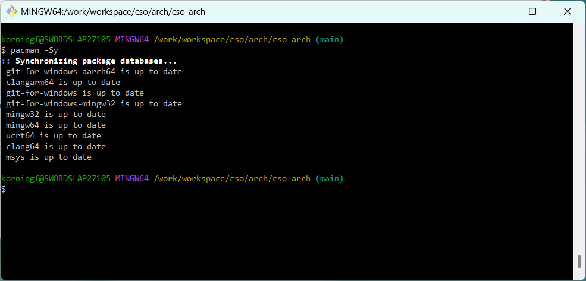

# CSO-git

CSO-Git is a GitBash portable POSIX augmented with the MSYS2 PacMan package manager.




It is based on GitBash, based on MSysGit, based on Msys2, itself derived from Cygwin.

Now GitBash ports git and core-utils on Windows, but it is missing other needed tools.

Tools that are fundamental for build development, systems integration, and automation.

Aegis-Git provides a bare minimum environment to drive Cloud-Ops and Dev-Ops automation.


# Abstract

Different institutions or individuals vary widely in their desktop security practices.

Some may allow a full Cygwin POSIX distribution, others MSsys, yet others merely GitBash.

We want a minimum POSIX environment for automation and integration on Windows Desktops.

.

For Automation, we need to authenticate, pull code from a repo, and run secure commands.

It should have, at minimum

- POSIX bash shell
- SSH Secure Shell
- GNU core utils
- package manager
- Git SCM

We will build up other systems on top of this.  Aegis-Git is the baremetal base box.


# Solution

We start with GitBash as baremetal base box, an atomic building block for other systems.

GitBash covers almost everything we need. The only thing missing is a package manager.

.

The key to getting this to work is to realise that underneath GitBash is a minimal MSys.

It is an MSys2 pared-down without a MinGW toolchain and without any package management.

.

Now GitBash itself is built on MSys2, specifically, inside SysGit / MSysGit, which does.

We can clone its `pacman` package management facility and reintegrate it into gitbash.


# Preparation

*Depending on the institution or individual, this may or my not be an Administrator installation*.

*IMPORTANT Uninstall any other competing variants of GitBash, MSys, SysGit, or any GitForWindows*.

Our objective is to get a working `pacman` package manager and interpreted and compiled languages.

Modern package managers use SSL/TLS and GPG keyrings to securely pull packages from distributions.

.

Uninstall  Git, Msys, Rtools.
        
Clear old git and cache:

```text
    %PROGRAMFILES%\Git
    %PROGRAMFILES%\Msys
    %PROGRAMFILES%\RTools
    %USERPROFILE%\AppData\Local\Git
    %USERPROFILE%\AppData\Local\pip
    %USERPROFILE%\AppData\Local\Programs\Git
    %USERPROFILE%\AppData\Local\Programs\pip
```


# GitBash

The Git OpenSSL libraries must be able to talk to Windows Credential manager and pull certificates.

For this reason, on a managed desktop machine it is best to install Git with the default settings.

.

install gitbash:

    winget install -e --id Git.Git -source winget


# Python

Mixed Python / Pip environments on Windows can be quite problematic with SSL/TLS and `Pyenv` `pipenv`.

The Python pip package manager must be able to talk to Windows Credential manager and pull certificates.

Python and pip in particular are very temperamental with mixed environments and mixed SSL/TLS bindings.

For this reason, on a managed desktop, it is best to install a managed machine-scoped Python for Windows. 

.

install python:

    winget install -e --id Python.Python.3.12 --scope machine
    


# Pacman

## Preparation

To get pacman working we to add the gpg key for the git-sdk-64 distribution in the keyring.

It turns out it has the same author and the same key as the git-for-windows distribution!


```bash
curl -L \
  https://raw.githubusercontent.com/git-for-windows/build-extra/HEAD/git-for-windows-keyring/git-for-windows.gpg | \
  pacman-key --add - && \
  pacman-key --lsign-key E8325679DFFF09668AD8D7B67115A57376871B1C && \
  pacman-key --lsign-key 3B6D86A1BA7701CD0F23AED888138B9E1A9F3986
```


## Installation

From a gitbash shell run `install-pacman-git-bash.sh` for the initial setup.

This installs the binaries, and sets up a mirror of the MSYS2 git-sdk-64 repo.


```bash
./install-pacman-git-bash.sh
```

  

## Configuration

First we update the pacman distribution itself.

```bash
pacman -Syy pacman --overwrite \*
pacman -Syu pacman --overwrite \*
```

```bash
pacman -Syy --overwrite \*
pacman -Syu --overwrite \*
```

Then we update util-linux and some core utils.

```bash
pacman -Syu coreutils util-linux --overwrite \*
pacman -Syuq tree pass  --overwrite \*
pacman -Syuq zip rsync  --overwrite \*
```


## Operation

We can now run pacman normally.


# Attribution


This project is a fork of [Aegis-Git](https://github.com/korningf/aegis-git).


*Stephane Korning* (stefuss@yahoo.com) for the idea and impetus to port pacman to gitbash. 


*Alex Sarmiento* and *David Gleba* for an actual implementation in their GitPortable-Pacman.

[gitportable-pacman](https://github.com/dgleba/gitportable-pacman)


*Johannes Schindelin* for Git-For-Windows and its underlying git-sdk-64 (Herculean work!).

[git for windows](https://gitforwindows.org/install-inside-msys2-proper.html)


The host of developers having made *Git*, *Msys*, *Cygwin*, *MinGW*, *GNU* and *POSIX* possible.


# License

Creative-Commons,  Attribution, NonCommercial, ShareAlike 4.0


